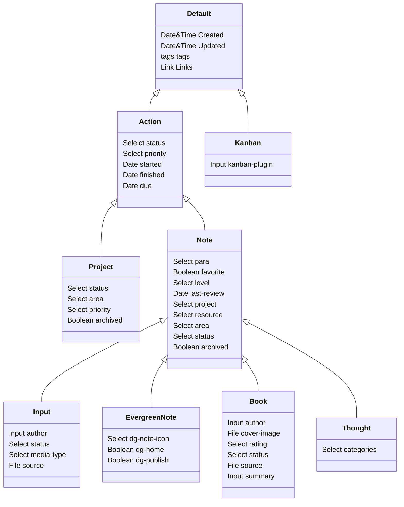

# How to use?

This is a tutorial about how to use this second brain.
## Step by Step
-  Press down `Ctrl + N`, select the `area` you want to maintain. The new area will display in the `2.Areas` folder. You can also find the new area in the file: `Home/My Areas`.
- In the new area, you can build a new project by press down `Ctrl + N`, then select `project`. Your new project will be found in the `1.Projects`. And you also create a new folder in the folder `1.Projects` , like this `1.Projects\TextProject\textProject`. In the new project file, you can add the exist area into the field `area` for linking to your area, representing this project belong to the area.
- After building a new project, you can click on `Create New Kanban` in your project file to create a task kanban for finishing your new project. All tasks due on today will be found in your daily note.
- Creating a daily note, you can add date for the task in kanban, then click on the date to create your daily note for finishing your task.  You can also click on the date in the calendar plugin to create your daily note.
- After a week, you can create a weekly note to review your works during this week, and all daily notes during this week will be found in your weekly note. You can easily click on each daily note for reviewing your work you have done.
- Quarterly note, monthly note and yearly note just like the weekly note, you can review your quarterly, monthly and yearly work you have done in these notes. And you can also click on the `Home/My Periodic Review` file to find the note you need to review. In there, all notes are displayed by classified into To be Daily Reviewed, To be Weekly Reviewed, and To be Monthly Reviewed.
-  For reading books and applying the knowledges acquired from book into your life or your work, you can create a Book Note or a Book Application Note. In this second brain, you can easily find and review the book notes by clicking on the file `Home/My Book`. 
- Nowadays, we can easily acquire knowledge from video, podcast, article, paper and so on. How to record them? In this second brain, you can use `input note` to record the informations or knowledge from them. The status of input notes, you can easily found it in the file `Home/My Inputs`. 
- How to record your thoughts from your life or work? You can easily to do this by create a thought note. For example, a thought from the sentense you read in website, or some words from other people. You can find your all thougs in the file `Home/My Thoughts`.
- It is important to see the development of our thoughts or views by searching the maturity of the notes. Five levels of maturity can be used to represent the development status of your notes. you can see all evergreen notes in file `Home/My Digital Garden`. These evergreen notes, if you want, you can publish to the website to build your online digital garden by set the fileld `dg-publish = true`.  This function is supported by [Digital Garden](https://github.com/oleeskild/obsidian-digital-garden) obsidian plugin. 
- Some topics may be discussed deeply with other for acquiring more understaning by using brainstorm note. So you can create a brainstorm note to do this.
- You can also archive the notes or projects you don't want to focus on into arichived notes by setting the field of note `archived = true`. All archived project or notes will be found in `Home/My Archives`. 

## The Inheritance of Note

All notes, including projects, areas, and notes, are inherited as follows, and others that are not in these three types of notes are called default notes inherited from class `Default`.

